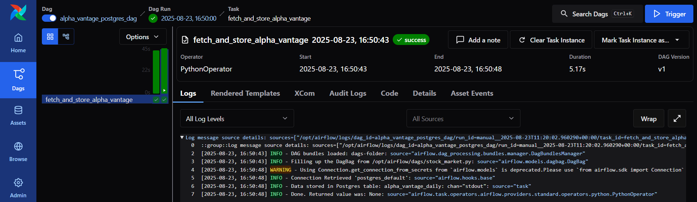
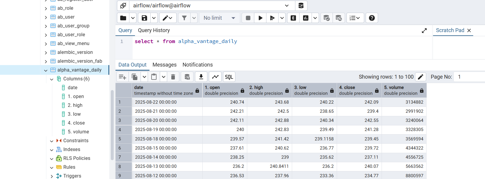

1. Clone the repo

2. Add .env file and inside add the following
    
     - **AIRFLOW_UID** = 50000
     - **ALPHA_VANTAGE** = your vantage api key

3. Create a virtual environment and make sure all the docker containers are stopped (Make sure docker is installed)

3. Now run "docker compose up airflow-init" inside vitual environment if process exited with 0 then you are good to go (Only run for the first time)

4. Now run "docker compose up" inside vitual environment (you can also run it in detach mode, but without it you can see the logs in the terminal)

5. Acess Airflow in "localhost:8080"

6. In the Airflow UI go to Admin->Connections and create a new connection with the following and click create:

    - **Connection ID:** `postgres_default`
    - **Connection Type:** Postgres
    - **Host:** `postgres`
    - **Login:** `airflow`
    - **Password:** `airflow`
    - **Port:** `5432`
    - **Database:** `airflow`

7. In Dags section of Airflow UI you can find "alpha_vantage_postgres_dag" toggle it (can see it in right side) and click the play button to run the dag

8. Click on the dag and find the logs for the run 
Example: 

9. After the successful run open PgAdmin (PostgresDB for local) and create a server with the following and click save:
   
   - **Name** : Airflow (In general)
   - **Host/Connection address** : localhost
   - **Port** : 5432
   - **Username** : airflow
   - **Password**: airflow

10. Once the server starts you can find a table "alpha_vantage_daily" in Airflow->database->schema->Tables

11. Open a query editor and run "select * from alpha_vantage_daily"
Example: 

12. Atlast run "docker compose down" to stop all the running containers (or "docker compose down -v" to remove all containers and volumes)